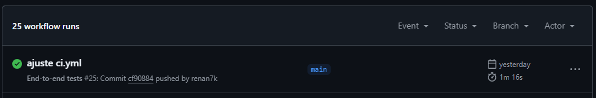
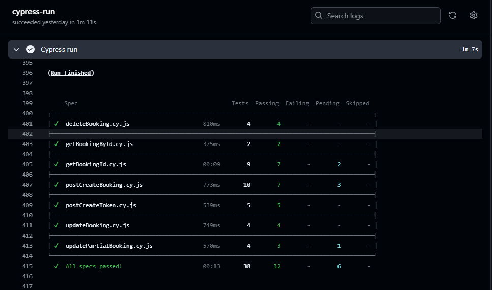
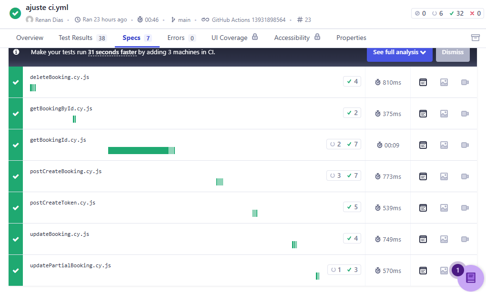

# 🏨📗  Projeto de automação de testes de API Rest - Booking
 Este repositório contém o projeto de automação de testes API de uma serviço de reserva de quartos, utilizando Cypress e JavaScript.
 A aplicação por ser de uso público, e voltada para identificação de bugs, possui muitas melhorias a serem implementadas, e que são abordadas em outro [diretório](https://github.com/renan7k/Teste_pratico_QA_Be_Talent), neste aqui criamos os testes com intuito de aplicar e revisar conhecimentos adquiridos anteriormente.    

 ## 🚀 Conhecimentos e Boas práticas aplicadas
 Os testes foram construídos utilizando ***Cypress***, ***JavaScript*** e a estrutura do ***Mocha***, seguindo no padrão ***AAA (Arrange, Act, Assert)***.  
 Utilizamos as bibliotecas ***faker.js*** e ***cypres-plugin-api***, para gerar dados e facilitar a análise quando os testes são executados no modo iterativo.  
O projeto também está integrado numa pipeline do ***gitHub Actions***, com relatório de report configurado no ***Cypress Cloud***.

 Além disso, procuramos aplicar boas práticas no desenvolvimento dos testes, como:   
> - Uso de ***comando customizado*** para reaproveitamento do código;  
> - Configuração de ***secrets do gitHub*** para utilização na integração com gitHub actions;  
> - Testes totalmente independentes;  
> - Testes determinísticos;

 ## 🛠️ Setup
 ### Pré requisitos
1 - [Node.js](https://nodejs.org/en/download)  (versão 20 ou superior)  
2 - IDE instalada. Utilizei o [VS Code](https://code.visualstudio.com/download) 

 ### Configuração/Instalação
1 - Clone o repositório 

```bash
git clone https://github.com/renan7k/Restful-Booker-Api.git
```
2 - Instalação das dependências
```bash
npm install
```

 ### Execução dos testes
1 - Para execução dos testes no modo iterativo:
```bash
npx cypress open
```

2 - Para execução dos testes no modo headless:
```bash
npx cypress run
```

 ## Github Actions 
Este repositório inclui um pipeline do GitHub Actions para executar os testes automaticamente a cada atualização no diretório.
Já possui configurado também as 'secrets' com as credenciais necessárias para execução de alguns testes, de forma que nenhuma informação sensível seja exposta.





 ## Cypress Cloud Reports 
Após a execução dos testes na pipeline do github Actions, o relatório dos testes estarão disponíveis no Cypress Cloud.
Lá, é possível acessar diversas informações como, histórico, tempo de execução, status por teste e/ou spec, dentre outras informações.

Dashboard:
https://cloud.cypress.io/projects/c6v5a5/



 ## Cenários de testes
 Os cenários estão separados por spec, seguindo as funcionalidades abaixo. Não contemplam em escopo completo, pois é um projeto com muitas melhorias. 
 Os testes seguem um caminho funcional, com validação de respostas, status code, variando também a forma de autenticação entre token e authorization para as rotas que precisam. 

 1 - Criação de token (POST)  
 2 - Criação de reserva (POST)  
 3 - Consulta de reservas por parâmetros (GET)  
 4 - Consulta de reserva por ID (GET)  
 5 - Alteração de reserva (PUT)  
 6 - Alteração parcial de reserva (PATCH)  
 7 - Deletar reserva (DELETE)  

Projeto realizado pelo [Renan Dias](https://www.linkedin.com/in/diasrenan1994/).  